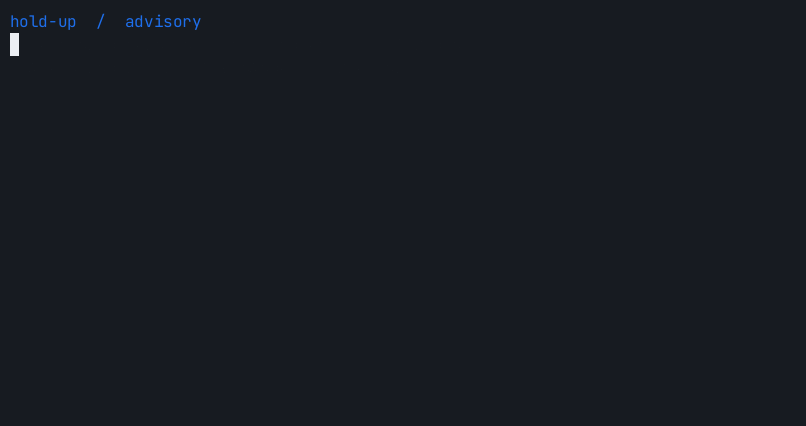

# Advisory and block demos

These simulated terminal presentations execute the installed hook against a
real local socket and isolated fixture decisions. AWS execution is a local
sentinel. Blocking uses fixture readiness only; the pinned model has not
qualified for production blocking. Display timing is edited for readability
and is not a latency measurement.

## Advisory

The unqualified decision emits advice and permits one sentinel execution.



[MP4](advisory.mp4) · [Replayable asciicast](advisory.cast)

## Block

The fixture decision prevents remote execution. Local inspection remains
available. Actual telemetry counts appear in both recordings.


[MP4](block.mp4) · [Replayable asciicast](block.cast)

## Reproduce

Install the Poetry package, [agg](https://docs.asciinema.org/manual/agg/usage/),
and FFmpeg. Rendering tools are optional development utilities; Python has no
additional runtime dependencies. No browser or recording server is required.

```sh
poetry run python tests/demo_terminal.py advisory > docs/demos/advisory.cast
agg --theme github-dark --font-size 16 --fps-cap 10 \
  --last-frame-duration 3 docs/demos/advisory.cast docs/demos/advisory.gif
ffmpeg -y -i docs/demos/advisory.gif -an -c:v libx264 -crf 28 \
  -pix_fmt yuv420p -vf 'fps=10,pad=ceil(iw/2)*2:ceil(ih/2)*2' \
  -movflags +faststart docs/demos/advisory.mp4
```

Repeat with `block` in place of `advisory`. Use `--client codex` or
`--client antigravity` to exercise another adapter; the presentation remains a
simulation rather than a recording of a native agent UI.

For a Unix pipeline that also saves the replay:

```sh
poetry run python tests/demo_terminal.py block \
  | tee docs/demos/block.cast \
  | agg --theme github-dark --fps-cap 10 - docs/demos/block.gif
```

GIFs embed directly in GitHub Markdown. MP4 files provide compact alternatives
for download or [attachment to issues and pull requests](https://docs.github.com/en/github-cli/github-cli/attaching-files-with-github-cli).
The committed assets use `agg 1.8.1` and FFmpeg; each GIF and H.264 MP4 is below
50 KiB. Casts contain only scripted fixture text.

Workshop was inspected for reuse. Its Windows capture example captures network
traffic, and its mobile observation recorder emits JSON metrics; neither
renders terminal animations. `agg` accepts an asciicast on stdin and supplies
the required headless renderer without adding a runtime library to hold-up.
